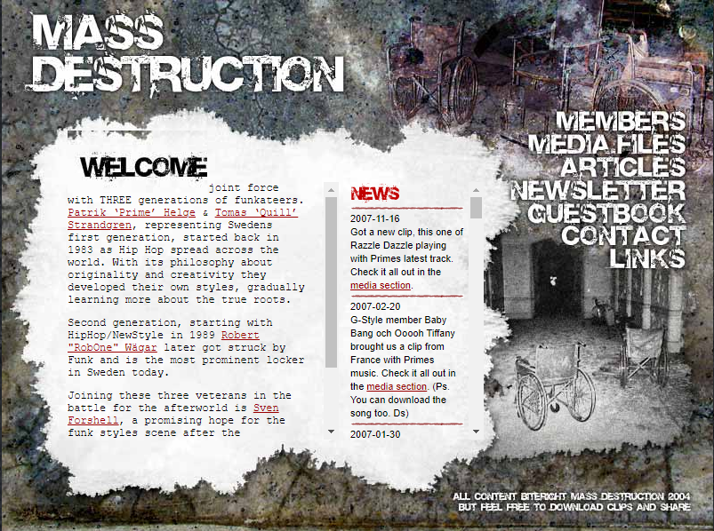

# Assignment 3 (Frameworks)

Implement a design from Dribble or a template or an existing website
Try to make it as close to the original as possible 

- this page is underconstruction but has everything needed for the CME assignment
I will remake this website, and also try to implement a comments section cause ours 
diden work, but I will remove the newsletter link

## My choice

Design from old crew website, a tribute to our dear member sven forshell who passed in 2016 
He was the designer and developer for the original website of massdestruction (popping and locking group)

## IMAGE from waybackmachine for design

 &nbsp; &nbsp;

## The old website
[Mass Desctruction . se](https://web.archive.org/web/20100523135817/http://www.massdestruction.se/)

## Demo online
Massdestruction Demo - [MD](https://massdestruction.vercel.app/)


## Rebuilding of design from an old crew website

So I changed my mind (from previous choice Assignment 1), 
I want to rebuild and old website. We had a popping crew back some 15-isch years ago 
our friend SLAM TILT - Sven Forshell (R.I.P) created this site and did the designs back then. 
He was also the person who put the group together. 
Crew members of Massdescruction was 
Slam Tilt,
Prime,
Quill,
Rob One

I hope this project is accepted as last minute change of heart.


## Tech Stack (Rebuilt with Next.js)

**Framework**: Next.js 16 with App Router  
**Frontend**: React 19  
**Styling**: Sass  
**Database** (optional): MongoDB Atlas  
**Hosting**: Vercel  
**Additional**: Framer Motion for animations, date-fns for date formatting

## Features

✅ **Full-stack with built-in API routes** - No separate backend needed  
✅ **Hidden admin panel** - Secure login at `/md-login`  
✅ **News management** - Post updates to homepage  
✅ **Guestbook moderation** - Manage visitor entries  
✅ **Vercel-ready** - Deploy instantly with env variables  
✅ **MongoDB Atlas** - Persistent news and guestbook storage

## Quick Start

```bash
npm install
npm run dev
```

Visit [http://localhost:3000](http://localhost:3000)

**Admin login**: `/md-login` using the server-side `MD_ADMIN_USER` and `MD_ADMIN_PASS` values

## Deployment

See [DEPLOYMENT.md](./DEPLOYMENT.md) for full Vercel setup instructions.


## __My Socials__

- Github - [robonexx](https://github.com/xxrobone)
- Linkedin - [Robert Wägar](https://www.linkedin.com/in/robert-w%C3%A4gar-1b4661139/)
- Portfolio - [Portfolio](https://www.robertwagar.se) - will do a remake using react or next
